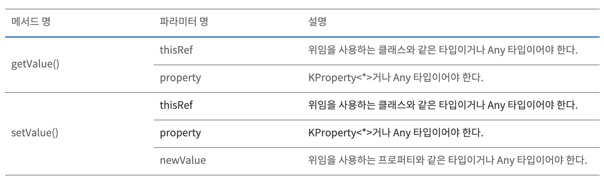

# ch7. 연산자 오버로딩과 기타 관계

## 1.산술 연산자 오버로딩

자바 에서는 원시 타입과 String 만 `+` 연산자 가 가능하지만 코틀린에서는 미리 정해진 이름의 함수를 연결해주는 기법을 `관례` 라고 하며 이를 이요하여 객체에 연산자 사용이 가능하다.

이번장에는 화면에 점을 표현하는 point 클래스를 예로든다.

### 1.1 이상 산술 연산 오버로딩

아래와 같이 Point 클래스에 연산자 오버로딩하는 함수 앞에 `operator` 키워드를 붙여 어떤 함수가 관계를 따르는 함수임을 명확히 할 수 있다.

```kotlin
data class Point(val x: Int, val y: Int) {
    operator fun Point.plus(other: Point): Point {
        return Point(x + other.x, y + other.y)
    }
}
```

그럼 이제 아래와 같이 `+` 를 사요하면 위의 관례에 적용된 `plus`함수가 호출된다.

```kotlin
val point1 = Point(1, 1)
val point2 = Point(1, 2 )

val point3 = point1 + point2

print(point3)

>>Point(x=2, y=3)
```


+ 연산자는 plus 함수 호출로 컴파일 된다.

a + b ---&gt; a.plus\(b\)


다른 함수도 똑같다. 회부 함수의 클래스에 대한 연산자를 정의할때는 관례를 따르는 이름의 확장 함수로 구현한다. 코틀린에서 정의할 수 있는 연산자 오버로딩의 할 수 있는 목록은 다음과 같다.

|  | 함수 이 |
| :--- | :--- |
| a \* b | times |
| a / b | div |
| a % b | mod \(1.1 부터 rem\) |
| a + b | plus |
| a - b | minus |


연산자 우선순위는 언제나 표준 숫자 타입에 대한 연산자 우선순위와 같다.

### a + b \* c 의 식에서 \* 이 먼저 수행된다.


### 1.2 복합 대입 연산자 오버로딩

Plus 와 같은 연산자를 오버로딩하면 코틀린은 + 연산자뿐 아니라 그와 관련있는 연자인 `+=`도 자동으로 함께 지원한다. 이를 `복합 대입 연산자`라 부른다.

`Point += Point(3, 4)`는 Point = Point + Point\(3, 4\) 라고 쓴것과 같다. 물론 변수가 변경가능할 때만 그렇다.

`+=` 연산이 객체에 대한 참조를 다름 참조로 바꾸기보다 원래 객체의 내부 상태를 변경하게 만들고 싶을 떄가 있다. `변경 가능한` 컬렉션 원소를 추가하는 경우다.

```kotlin
val numbers = ArrayList<Int>()
numbers += 12
println(numbers[0])

>> 12
```

반환 타입이 Unit 인 plusAssign 함수를 정의하면 코틀린은 += 연산자에 그 함수를 사용한다.

비숫하게 `minusAssign`, `timesAssign` 등의 이름을 사용한다.

```kotlin
@kotlin.internal.InlineOnly
public inline operator fun <T> MutableCollection<in T>.plusAssign(element: T) {
    this.add(element)
}
```

클래스를 설계할 때 `plus` 와 `plusAssign` 을 동시에 추가하지 말라, 혼란을 야기할 수 있다. 변경 가능한 클래스를 설계하려면 `pliusAssign`을 변경 불가한 클래스는 `plus` 를 추가하여 새로운 값을 반환하는 연산만을 추가하는 것이 좋다.


### +, - 는 항상 새로운 컬렉션을 반환하며

### +=, -= 연산자는 항상 변경 가능한 컬렉션에 작용해 메모리에 있는 객체 상태를 변화한다.


```kotlin
val list = ArratList<Int>()

list += 3 // list 를 변경

val newList = list + listOf(1, 2 ,3) // 새로운 객체 반환
```

### 1.3 단항 연산자 오버로딩

`-a` 와 같은 단항 연산자도 제공한다. 이것 또한 `operator`키워드를 이용해서 사용한다.

아래와 같이 연산자를 로버로딩 하여 단항 연산자를 사요할 수 있다.

```kotlin
operator fun Point.unaryMinus(): Point {
    return Point(-x, -y)
}
```

아래는 단항 연산자를 오버로딩 할 수 있는 목록이다.

| 식 | 함수 이 |
| :--- | :--- |
| +a | unaryPlus |
| -a | unaryMinus |
| !a | not |
| ++a, a++ | inc |
| --a, a-- | dec |


후위 연산 ++ 은 먼저 값을 반환한 다음에 값을 증가시킨다. 반면 전위 연산은 그 반대로 수행된다.


## 2. 비교 연산자 오버로딩

### 2.1 동등성 연산자: equals

코틀린 `==` 연산자는 `equals` 메소드를 호출하는데 `!=` 연산자 또한 `equals`로 호출된다. 물론 이 경우 배교 결과를 뒤집은 값을 값으로 사요한다.

`==`와 `!=`은 내부적으로 null인지 아닌지를 검사하기때문에 좌항이 null일 경우 우항도 null이여야 true를 반환한다.

`data class`는 `equals`를 생성해 주기때문에 일반 클래스는 `equls`를 재정의 해야하는 것을 기억하라.

식별자 비교는 `===`를 이용하여 진행되는데, 이는 자신의 두 피 연산자가 서로 같은지를 비교한다. 때문에 `===`는 오버라이딩 할 수 없다.


### Any 에서 상속받은 equals 함수는 확장 함수보다 우선순위가 높지 않기 때문에 확장함수로 정의할 수 없다.


### 2.2 순서 연산자: compareTo

코틀린에서도 java처럼 `Comparable`인터페이스를 제공한다. 코틀린은 Comparable 인터페이스 안에 있는 `compareTo` 메소드를 호출하는 관례를 제공한다.

따라서 `<, >, <=, >=`는 compareTo 호출로 컴파일된다. compareTo는 `Int`를 반환한다.

```text
a >= b ---> a.compareTo(b)
```

따라서 코틀린에서 Comparable 인터페이스를 구현하는 모든 자바 클래스를 코틀린에서는 간결한 연산자 구문으로 비교할 수 아있다.

```kotlin
println("abc" < "bac")

비교 연산자를 자바 클래스에 대해 사용하기 위해 특별히 확장 메소드를 만들거나 할 필요는 없다.
```

## 3. 컬렉션과 범위에 대해 쓸 수 있는 관례

컬렉션을 다룰 때 가장 많이 사용하는 연산은 인덱스를 사용해 원소를 읽거나 쓰는 연산과 어떤 값이 컬렉션에 속해 있는지 검사하는 연산이다. 이 모든 연산을 연산자 구문으로 사용할 수 있다.

`in`연산자는 원소가 컬렉션이나 범위에 속하는지 검사하거나 컬렉션에 있는 원소를 이터레이션할 때 사용된다. 이때 코틀린에서 어떤 관례가 있는지 확인해보자.

### 3.1 인덱스로 원소에 접근: get과 set

인덱스의 원소에 접근할때 `[0]`, `[1]` 등으로 접근하고 set할때 때한 사용된다.

이 또한 코틀린의 관계로 재정의할 수 있다.

```kotlin
data class Point(val x: Int, val y: Int) {

}

operator fun Point.get(index: Int): Int {
    return when(index) {
        0 -> x
        1 -> y
        else -> throw IndexOutOfBoundsException("Invalid coordinate $index")
    }
}

val point = Point(1, 1)
point[0]

>> 1
```

위의 코드는 get을 관계를 재정의하여 point의 x, y에 인데스처럼 쉽게 접근하게 할 수 있다.

### 3.2 in 관례

`in` 은 컬렉션에 들어있는지 검사한다. 그런 경우 in 연산자와 대응하는 함수는 `conatin`다.

```kotlin
operator fun Point.contains(p: Point): Boolean {
    return p.x in 1 until 12 && p.y in 1 until 12
}
```


10..20 이라는 열린 범위식은 10부터 20 까지지고, 10 until 20 은 10 부터 19 까지 이다.


### 3.3 rangeTo 관례

범위를 만들기 위해는 `..` 구문을 사요해야 한다. 예를들어 1..10 은 1 부터 10 까지의 모든 수가 들어있는 범위를 말한다.

`.. 연산자는` `rangeTo` 함수를 간략하게 표현하는 방법이다.

```kotlin
val n = 9

print(0..(n+1))

>> 0..10
```

또한 `0..n.forEach {}` 같은 식은 컴파일할 수 없다. 범위 연산자는 우선순위가 낮아서 범위의 메소드를 호출하려면 범위를 괄호로 감싸야한다. `(0..n).forEach {}`

## 4. 구조분해 선언과 component 함수

`구조 분해`를 사용하면 복합적인 값을 분해해서 여러 다른 변수를 한꺼번에 초기화할 수 있다.

```kotlin
val p = Point(10, 20)
val (x, y) = p
print(x)

>> 10
```

구조분해 선언은 변수선언과 비슷해 보이지만 각 변수를 초기화 하기위해 `ComponentN`이라는 함수를 호출한다.

```text
val (a, b) = p

val a = p.component1()
val b = p.component2()
```

data class 의 주 생성자에 들어있는 프로퍼티에 대해서는 컴파일러가 자동으로 `componentN`함수를 생성해준다.

아래는 데이터 타입이 아닌 클래스에서 이런 함수를 어떻게 구현하는지 보여준다.

```text
class NormalPoint(val x: Int, val y: Int) {
    operator fun component1() = x
    operator fun component2() = y
}

val (aa, bb) = NormalPoint(10, 20)
print(aa)

>> 10
```

여러 값을 한꺼번에 반환해야 하는 함수가 있다면 반환해야 하는 모든 값을 저장하는 data class를 정의하고 이를반환하게 할 수 있다.

파일명과 확장자를 쉽게 구할 수 있는 함수를 만드는 것이 가능하다.

```kotlin
data class NameComponent(val name: String, val extension: String)

fun splitFileName(fullName: String): NameComponent{
    val result = fullName.split(".")
    return NameComponent(result[0], result[1])
}

val (name, extension) = splitFileName("example.kt")
print(extension)

>> kt
```

### 4.1 구조분해 선언과 루프

루프에서 구조분해가 아래와 같이 가능하다.

```kotlin
for((key,value) in map){
    ...
}
```

## 5.프로퍼티 접근자 로직 재활용: 위임 프로퍼티

위임 프로퍼티를 사용하면 갑을 뒷받침하는 필드에 단순히 저장하는 것보다 더 복잡한 방식으로 작동하는 프로퍼티를 쉽게 구현할 수 있다.

위임은 객체가 직접 그 일을 수행하지 않고 `다른 도우미 객체`가 그 일을 수행하는 것을 말한다.

```kotlin
class Foo {
    var p: type by Delegate()
}
```

위의 코드에서 `by`키워드는 `뒤에 있는 식을 계산해서 위임에 쓰일 객체를 얻는다.` 즉, 연결한다.

컴파일러는 숨겨진 도우미 프로퍼티를 만들고 바로그 위임 객체에게 자신의 작업을 위임한다.

### 5.2 위임 프로퍼티 사용: by lazy\(\)를 사용한 프로퍼티 초기화 지연

`지연 초기화`는 객체의 일부분을 초기화 하지 않고 남겨뒀다가 실제로 그 부분의 값이 필요한 경우 초기화할 때 흔히 쓰이는 패턴이다.

예를들어 Person 클래스가 이메일을 데이터베이스에서 가져온다고 할 때 시간이 오래 걸린다. 그래서 이메일값을 최초로 사용할때 단 한번만 이메일을 데이터베이스에서 가져오고 싶다.

```text
class Person {
    var _emails: List<String>? = null

    var emails: List<String>
        get() = {
            if(_email == null) {
                _emails = getEmails()
            }

            return _emails!!
        }
}
```

먼저 `_emails`를 null값으로 두고 최소로 이 값이 쓰일때 값이 있는지 확인하여 값을 가져온다.

이 방식은 다소 성가신 방법이다. 이때 지연 초기화를 사용하면 최초 사용시에 데이터를 가져오는것을 보장해준다.

```text
class Person {
    var emails: List<String> by lazy { getEmails() }
}
```

`lazy` 함수의 인자는 값을 초기화할 때 호출할 람다다. 기본적으로 lazy는 `스레드 안전`하다.

### 5.3 위임 프로퍼티 구현

* 클래스 위임과 비슷하게 프로퍼티의 값 설정 `set`, `get` 에서 위임을 사용할 수 있다.
* 읽기전용\(val\) 일 경우에는 `getValue()`만, 읽기/쓰기 \(var\) 일 경우 getValue\(\)/setValue\(\)를 구현한다.

```kotlin
class PropertyDelegate(var value: String) {
    operator fun getValue(thisRef: Any?, property: KProperty<*>): String {
        return value
    }

    operator fun setValue(thisRef: Any?, property: KProperty<*>, newValue: String) {
        this.value = newValue
    }
}
```



아래 코드처럼 프로퍼티 `by` 뒤에 위임 클래스를 선언하면 된다.

```kotlin
class Human {
    val name: String by PropertyDelegate("ewan")
    val age: String by PropertyDelegate("31")
}

val h = Human()
print(h .name)

>> ewan
```

Human 클래스의 프로퍼티가 val 일경우 set이 안되는것은 당연하다.

이렇게 프로퍼티 위임을 사용하면 프로터피에 접근과 수정을 특수하게 처리할  수 있다.

### 5.4 위임 프로퍼티 컴파일 규칙

다음과 같은 위임 프로퍼티 클래스가 있다고 해보자.

```kotlin
class c {
    var prop: Type by MyDelegate()
}
```

컴파일러는 MyDelegate 클래스에 인스턴스를 감춰진 프로퍼티에 저장하며 그 감춰진 프로퍼티를 라는 이름으로 부른다. 또한 컴파일러는 프로퍼티를 표현하기 위해 `Kproperty` 타입의 객체를 사용한다.

### 5.5 프로퍼티 값을 맵에 저장

자신의 프로파티를 동적으로 적용할 수 있는 객체를 만들 때 위임 프로퍼티를 사용하는 경우가 있다. 그런 객체를 `확장 가능한 객체`라고 부른다.

어떤 값들을 map에 넣고 사용할때 별도의 로직 없이 위임을 사용해서 처리할 수 있다.

```kotlin
class person {
    private _attribute = hashMapOf<String, String>()

    fun setAttribute(attrName: String, value: String){
        _attribute[attrName] = value
    }

    val name: String by _attribute  // 위임 프로퍼티로 맵을 사용
}
```

이런 코드가 작동하는 이유는 표준 라이브러리가 Map과 MutableMap인터페이스에 대해 getValue\(\)와 setValue\(\) 함수를 제공하기 때문이다. getValue\(\)에서 맵에 프로퍼티 값을 저장할 때는 자동으로 프로퍼티 이름을 키로 활용한다.

## 요약

* 코틀린에서는 정해진 이름의 함수를 오버로딩함으로써 표준 수학 연산자를 오버로딩 할 수 있다. 하지만 직접 새로운 연산자를 만들 수는 없다.
* 비교 연산자는 equals와 compareTo 메소드로 변환된다.
* 클래스에 get, set, contains라는 함수를 정의하면 그 클래스의 인스턴스에 대해 \[\]와 in연산을 사용할 수 있고, 그 객체를 코틀린 컬렉션 객체와 비슷하게 다룰 수 있다.
* 미리 정해진 관례를 따라 rangeTo, iterator 함수를 정의하면 범위를 만들거나 컬렉션 배열의 원소를 이터레이션할 수 있다.
* 구조 분해 선언을 통해 한 객체의 상채를 분해해서 여러 변수에 대입할 수 있다. 함수가 여러 값을 한꺼번에 반환해야 하는 경우 구조 분해가 유용하다.
* 위임 프로퍼티를 통해 프로퍼티 값을 저장하거나 초기화하거나 읽거나 변경할 떄 사용하는 로직을 재활용할 수 있다. 위임 프로퍼티는 프레임워크를 만들 떄 아주 유용하다.
* 표준 아이브러리 함수인 lazy를 통해 지연 초기화 프로퍼티를 쉽게 구현할 수 있다.
* 맵을 위임 객체로 사용하는 위임 프로퍼티를 통해 다양한 속성을 제공하는 객체를 유연하게 다룰 수있다.

