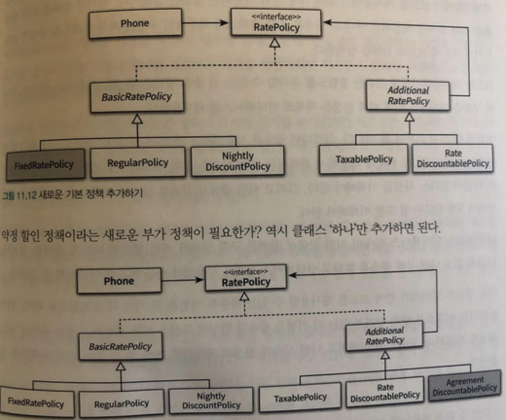

# ch11. 합성과 유연한 설계

* 상속 : 부모 클래스와 자식 클래스를 연결해서 부모클래스의 코드를 재사용 하는 방법, 컴파일타임에 해결, is-a 관계
* 합성 : 전체를 표현하는 객체가 부분을 표현하는 객체를 포함해서 부분 객체의 코드를 재사용하는것, 런타임에 해결, has-a

## 1.상속을 합성으로 변경하기

10장의 상속을 남발하며 생긴 아래의 문제점들을 함성으로 해결할 수 있다.

* 불필요한 인터페이스 상속 문제
* 메서드 오버라이딩의 오작용 문제
* 부모 클래스오하 자식 클래스의 동시 수정 문제

## 2. 상속으로 인한 조합의 폭발적인 증가

상속으로 인해 결합도가 높아지면 다음과 같은 두 가지 문제점이 발생한다.

* 하나의 기능을 추가하거나 수정하기 위해 불필요하게 많은 수의 클래스를 추가하거나 수정해야 한다.
* 단일 상속만 지원하는 언어에서는 `상속으로 인해 오히려 중복 코드의 양이 늘어날` 수 있다.

.png>)

## 3.합성 관계로 변경하기

합성 관계로 변경시 런타임에 의존하기 때문에 확장이 쉽고 유연하게 설계를 할 수 있다.

```java
public class Phone {
    private RatePolicy ratepolicy;
    private List<Call> calls = new ArrayList<>();

    public Phone(RatePolicy ratePolicy) {
        this.ratePolicy = ratePolicy;
    }

    public List<Call> getCalls() {
        return Collections.unmodifiableList(calls);
    }

    public Money calculateFee() {
        return ratePolicy.calculateFee(this);
    }
}
```

Phone 클래스에서 사용하는 RatePolicy 타입을 인터페이스로 정의한다.

```java
public interface RatePolicy {
    Money calculateFee(Phone phone);
}
```

RatePolicy를 구현한 추상 클래스를 생성한다.

```java
public abstract class BasicRatePolicy implements RatePolicy {
    @Override
    public Money calculateFee(Phone phone) {
        Money result = Money.ZERO;

        for(Call call : phone.getCalls()) {
            result.plus(calculateCallFee(call));
        }

        return result;
    }

    abstract protected Money calculateCallFee(Call call);
}
```

추상 클래스를 상속받은 구현 클래스를 정의

```java
public class RegularPolicy extends BasicRatePolicy {
    private Money amout;
    private Duration seconds;

    public RegularPolicy(Money amount, Duration seconds) {
        this.amount = amount;
        this.seconds = seconds;
    }

    @Override
    protected Money calculateCallFee(Call call) {
        return amount.times(call.getDuration().getSeconds() / seconds.getSeconds());
    }
}
```

부가 연산을 구현할 추상클래스 생성

```java
public abstract class AdditionalRatePolicy implements RatePolicy {
    private RatePolicy next;

    public AdditionalRatePolicy(RatePolicy next) {
        this.next = next;
    }

    @Override
    public Money calculateFee(Phone phone) {
        Money fee = next.calculateFee(phone);

        return afterCalculated(fee);
    }

    abstract protected Money afterCalculated(Call call);
}
```

실제로 클라이언트에서는 런타임시에 다양한 조합이 가능해진다.

```java
Phone phone = new Phone( new TexablePolicy(0.05,
                           new RateDiscountablePolicy(Money.wons(1000),
                             new RegularPolicy(...)));
```



## 4. 믹스인

`믹스인(mixin)`은 객체를 생성할 때 `코드 일부`를 클래스 안에 섞어 넣어 `재사용`하는 기법을 가리키는 용어다. 합성이 실행 시점에 객체를 조합하는 재사용 방법이라면 믹스인은 `컴파일 시점`에 필요한 코드 조각을 조합하는 재사용 방법이다.

### 믹스인은 상속과 다르다.

여기까지 설명을 듣고 나면 믹스인과 상속이 유사한 것처럼 보이겠지만 믹스인은 상속과는 다르다. 상속의 진정한 목적은 자식 클래스를 부모 클래스와 `동일한 개념`적인 범주로 묶어 `is-a` 관계를 만들기 위한 것이다. 반면 믹스인은 말 그대로 `코드`를 다른 코드 안에 섞어 넣기 위한 방법이다.


