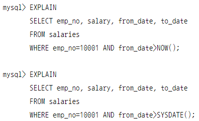

# Service의 네트워크구조

<figure><figcaption></figcaption></figure>

#### 1. **네트워크 구성**

* **내부 인프라 환경**:
  * 내부 서버 및 DNS 서버가 포함된 사설 네트워크가 있다.
  * DNS 서버(192.168.56.50)는 사내 DNS를 관리하며, 이 DNS 서버를 통해 외부 DNS와의 연결도 가능하다
  * MasterNode 의 `coreDNS` 는 사내 DNS 서버와 연결이 되어 있어야 pod 에서 원하는 도메인으로 접근이 가능하다
* **쿠버네티스 클러스터**:
  * **Master Node** (192.168.56.30): 쿠버네티스 클러스터의 control  plane 이다.
  * **Worker Node 1 & 2** (192.168.56.31, 192.168.56.32): 애플리케이션이 실제로 실행되는 노드
  * 각 Node에는 `kubelet`, `kube-proxy` 등의 쿠버네티스 핵심 구성 요소들이 설치되어 있다.
* **VM 네트워크** (192.168.56.0/24): 여러 VM들이 연결된 가상 네트워크
  * 이 네트워크는 게이트웨이와 라우터를 통해 외부 네트워크와 연결된다.
  * `LoadBalancer`(192.168.56.60)를 통해 외부로부터의 트래픽이 관리된다
  * 위 그림에서는 LoadBalancer 타입의 service 가 ip 를 할당받아 외부로 부터 들어오는 트래픽을 쿠버네티스 노드들에게 전달한다

#### 2. **서비스 디스커버리와 네트워킹**

* **Service Network (10.96.0.0/12)**: 쿠버네티스 클러스터 내의 모든 서비스들이 이 네트워크를 통해 통신한다.
* **Pod Network (20.96.0.0/12)**: 각각의 Pod가 이 네트워크를 통해 IP 주소를 할당받아 통신한다.
* **CoreDNS**: 클러스터 내부에서 DNS 서비스를 제공, 각 서비스의 DNS 이름을 관리하고, 외부 DNS 요청도 처리한다.

#### 3. **Service 타입**

* **ClusterIP**: 쿠버네티스 클러스터 내부에서만 접근 가능한 기본 서비스 타입이다
  * `api-tester`(10.96.0.1) 서비스는 ClusterIP 타입으로, 내부 통신에 사용된다.
* **NodePort**: 클러스터 외부에서 접근할 수 있도록 각 노드의 특정 포트로 서비스를 노출.
  * `Worker Node 1`과 `Worker Node 2`는 NodePort로 외부와 연결
* **LoadBalancer**: 클라우드 제공자의 로드 밸런서를 사용하여 외부 트래픽을 여러 노드에 분배
  * 192.168.56.60 IP를 가진 로드 밸런서가 이를 담당
* **ExternalName**: 클러스터 외부에 있는 서비스의 이름을 DNS 이름으로 직접 매핑
  * `ext-github`는 외부의 `github.com`으로 매핑
* **Headless Service**: ClusterIP 없이 Pod에 직접 DNS 이름을 할당하여 각각의 Pod를 직접 접근할 수 있게 한다.
  * 이 그림에서는 `db`가 StatefulSet으로 배포된 애플리케이션으로, Headless Service로 구성되어 있다.

#### 4. **StatefulSet 및 Headless Service**

* **StatefulSet**: 상태를 가지는 애플리케이션을 관리하며, 각 Pod는 고유한 정체성을 가진다
* **Headless Service**: StatefulSet에서 사용하는 서비스로, 각 Pod에 고유한 IP를 할당한다
  * `api-tester2` 및 `db` 서비스가 여기에 해당됨

#### 5. **로드 밸런싱과 IPTABLES**

* **kube-proxy**: 쿠버네티스의 네트워크 트래픽을 관리하며, iptables를 사용하여 트래픽을 라우팅한다.
* **IPTABLES**: 네트워크 트래픽을 제어하고, 각 서비스로의 연결을 관리한다

#### 6. **서비스 퍼블리싱**

* 외부에서 내부 서비스로 접근하려면 LoadBalancer를 통해 연결됩니다. 그림에서는 192.168.56.60이 이 역할을 수행하고 있다.
* 보안 포트를 통해 외부 사용자가 내부 서비스에 접근할 수 있다.
